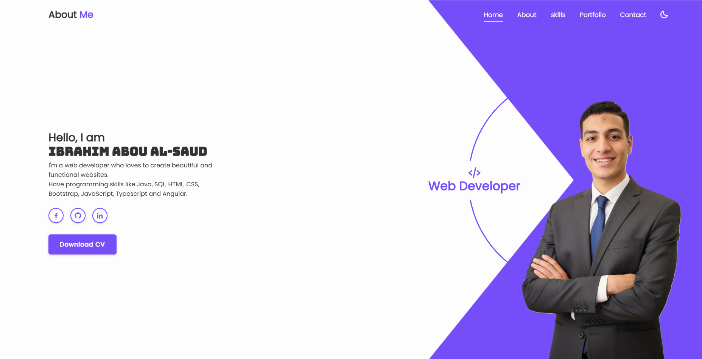
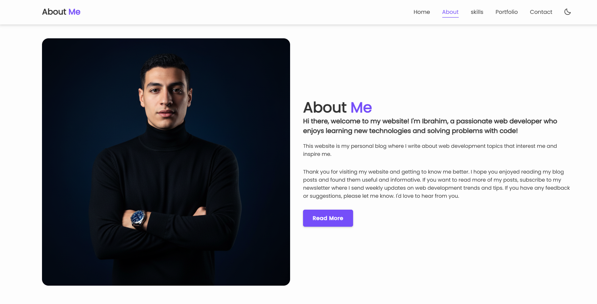
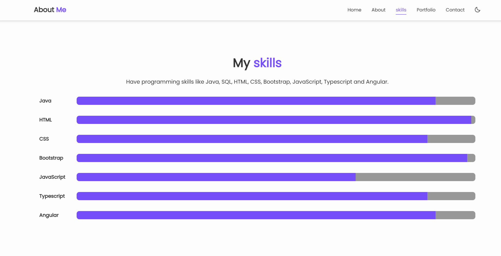
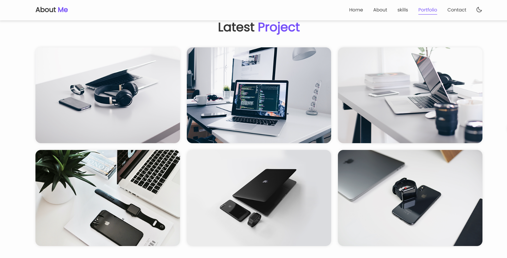
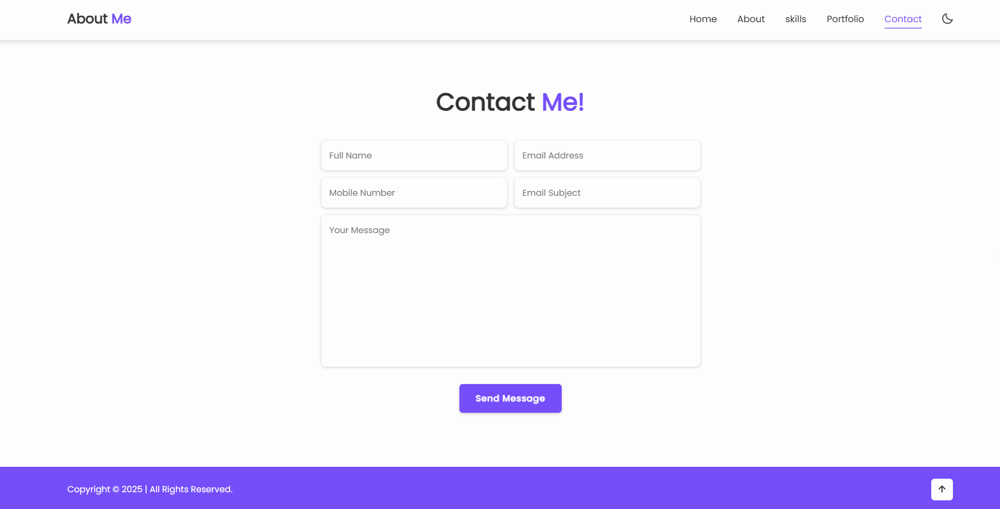

# 🚀 Personal Portfolio Website

A modern and responsive personal portfolio website built using HTML, CSS, and JavaScript to showcase my skills, projects, and contact information.

## 📌 Features

- Fully responsive design
- Smooth scroll animations (ScrollReveal)
- Animated skill progress bars
- Projects portfolio section
- Contact form
- Modern UI/UX layout

## 🛠️ Technologies Used

- HTML5
- CSS3
- JavaScript
- ScrollReveal.js

## 📁 Project Structure

project-folder/  
│── index.html  
│── style.css  
│── script.js  
│── images/  
│── README.md

## ⚙️ How to Run

1. Download or clone the repo:  
   `git clone [https://github.com/your-username/portfolio](https://github.com/Ibrahim-Abou-Al-Saud/About-Me).git`
2. Open the folder
3. Run **index.html** in your browser

## 🌐 Live Demo

Add your live website link here:  
**[https://AboutMe.com](https://ibrahim-abou-al-saud.github.io/About-Me/)**

## 📸 Screenshots

## 📬 Contact

- Email: ibrahimaboalsoud1@gmail.com
- LinkedIn: https://www.linkedin.com/in/ibrahim-abou-al-saud-89264a224
- GitHub: https://github.com/Ibrahim-Abou-Al-Saud

## ✨ Future Improvements

- Add more projects
- Add dark/light mode
- Add blog section
- Add more animations
